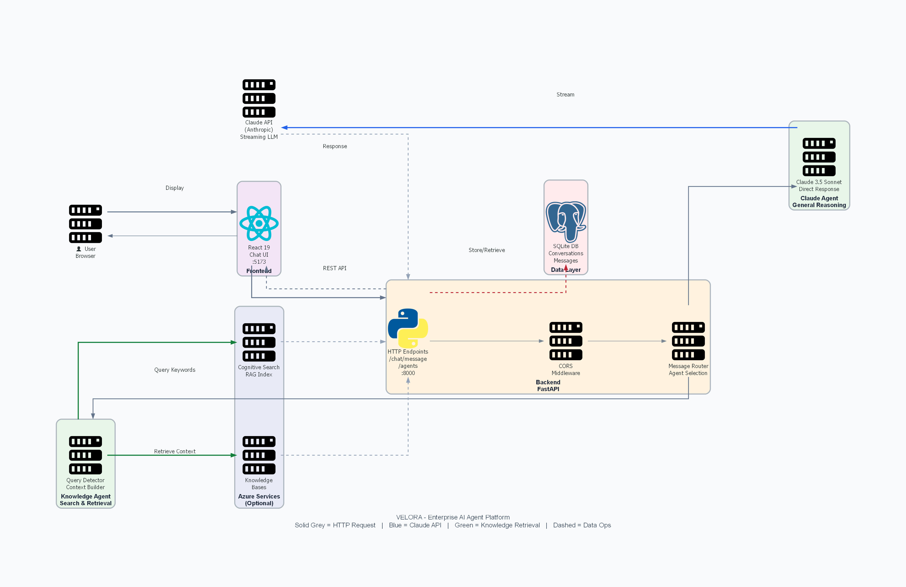
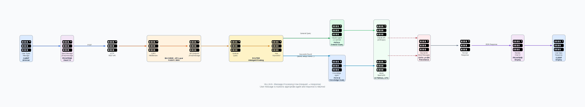

# NEXUS - Multi-Agent AI Intelligence Platform

A full-stack intelligent assistant platform that integrates with Azure services and LLMs to provide context-aware answers about enterprise data platforms and services.

## 🎯 Overview

NEXUS is a sophisticated multi-agent system designed to help organizations navigate complex data and AI infrastructure. It combines:

- **Claude AI** for intelligent reasoning and conversation
- **Azure Cognitive Search** for intelligent document retrieval
- **Azure Knowledge Base** for specialized knowledge management
- **React + TypeScript** for a modern, responsive UI
- **Python/FastAPI** for a robust backend

Users can query information about 35+ enterprise services (Snowflake, Tableau, Power BI, Neo4j, Airflow, etc.) through a conversational interface powered by advanced AI agents.

## 🏗️ Architecture

### System Architecture


**Key Components:**
- **Frontend**: React 19 chat interface (:5173)
- **Backend**: FastAPI REST API (:8000) with intelligent message router
- **Agents**: Claude Agent (general) + Knowledge Agent (search)
- **Database**: SQLite (conversations & messages)
- **Azure Services**: Cognitive Search & Knowledge Bases (optional)
- **External**: Claude API (Anthropic) for LLM

### Message Flow


**How It Works:**
1. User sends message in React chat interface
2. Frontend makes REST API call to `/chat/message`
3. Backend router analyzes message content
4. **If general query** → Routes to Claude Agent → Calls Claude API
5. **If keywords detected** (azure, setup, how-to, etc.) → Routes to Knowledge Agent → Queries Azure Search/KB
6. Response stored in SQLite database
7. Response returned to frontend and displayed

## 📋 Features

### Core Features
- **Intelligent Chat Interface** - Conversational AI powered by Claude 3.5 Sonnet
- **Multi-Agent Architecture** - Specialized agents for different query types
- **Azure Search Integration** - RAG (Retrieval Augmented Generation) for accurate answers
- **Knowledge Base Support** - Direct integration with Azure Knowledge Bases
- **Conversation History** - Persistent chat history with database storage
- **Service Registry** - Knowledge of 35+ enterprise services with aliases and documentation links
- **Markdown Support** - Rich message formatting with code blocks and tables

### Technical Features
- **Type-Safe Frontend** - Full TypeScript with ESLint
- **Modern React** - React 19 with hooks and context API
- **Beautiful UI** - TailwindCSS + shadcn/ui components
- **REST API** - Clean, documented FastAPI endpoints
- **Error Handling** - Graceful error recovery and user feedback
- **Logging** - Comprehensive logging for debugging

## 🚀 Quick Start

### Prerequisites
- Python 3.10+ (Backend)
- Node.js 18+ (Frontend)
- Azure Search Service (required)
- Anthropic API Key (required)
- Azure Knowledge Base IDs (optional but recommended)

### Installation

#### 1. Backend Setup

```bash
cd BACKEND

# Create .env.local file
cat > .env.local << 'EOF'
# Azure Search
AZURE_SEARCH_ENDPOINT=https://YOUR-SERVICE.search.windows.net
AZURE_SEARCH_SERVICE_NAME=YOUR-SERVICE
AZURE_SEARCH_INDEX_NAME=rag-index-ai-attack
AZURE_SEARCH_SERVICELINKS_INDEX=docs-links

# Anthropic API
ANTHROPIC_API_KEY=sk-ant-xxxxxxxxxxxxx
ANTHROPIC_MODEL=claude-3-5-sonnet

# Knowledge Base (optional)
USE_KB_AGENT=true
AZURE_KB_ID_AZURE=kb-ai-attack-azure
AZURE_KB_ID_AWS=kb-ai-attack-aws

# Logging
LOG_LEVEL=INFO
API_PORT=8000
EOF

# Install dependencies
pip install -r requirements.txt

# Start backend
python -m uvicorn main:app --reload --port 8000
```

#### 2. Frontend Setup

```bash
cd FRONTEND

# Create .env.local file
cat > .env.local << 'EOF'
VITE_API_URL=http://localhost:8000
EOF

# Install dependencies
npm install

# Start development server
npm run dev
```

### Verification

- **Backend**: `curl http://localhost:8000/agents` → Should return agent list
- **Frontend**: Open `http://localhost:5173` → Should load chat interface
- **Chat**: Type a message → Should see response from AI

## 📁 Project Structure

```
NEXUS/
├── FRONTEND/                    # React TypeScript Application
│   ├── src/
│   │   ├── components/         # React Components
│   │   │   ├── ChatPage.tsx
│   │   │   ├── ChatWindow.tsx
│   │   │   ├── ChatInput.tsx
│   │   │   ├── Message.tsx
│   │   │   └── ...
│   │   ├── context/            # React Context
│   │   │   ├── AuthContext.tsx
│   │   │   ├── ChatContext.tsx
│   │   │   └── ThemeContext.tsx
│   │   ├── hooks/              # Custom Hooks
│   │   ├── pages/              # Page Components
│   │   ├── lib/                # Utilities & Config
│   │   └── App.tsx
│   ├── package.json
│   └── tsconfig.json
│
├── BACKEND/                     # Python FastAPI Application
│   ├── agents/                 # Agent System
│   │   ├── base_agent.py
│   │   ├── claude_agent.py
│   │   ├── knowledge_agent.py
│   │   ├── knowledge_agent_kb.py
│   │   └── agent_registry.py
│   ├── services/               # Azure & External Services
│   │   ├── azure_cognitive_search_service.py
│   │   ├── azure_knowledge_base_service.py
│   │   ├── azure_storage_service.py
│   │   ├── auth.py
│   │   └── ...
│   ├── middleware/             # Express-like Middleware
│   ├── main.py                 # FastAPI App Entry
│   ├── models.py               # Database Models
│   ├── database.py             # Database Setup
│   ├── requirements.txt        # Python Dependencies
│   └── services_config.json    # Service Registry
│
├── ENV_SETUP_GUIDE.md          # Detailed Setup Instructions
├── QUICK_ENV_CHECKLIST.md      # Quick Reference
└── README.md                   # This File
```

## 🔧 Configuration

### Environment Variables

**Required (BACKEND/.env.local):**
- `AZURE_SEARCH_ENDPOINT` - Azure Search service URL
- `AZURE_SEARCH_SERVICE_NAME` - Azure Search service name
- `AZURE_SEARCH_INDEX_NAME` - RAG index name
- `ANTHROPIC_API_KEY` - Claude API key

**Optional:**
- `USE_KB_AGENT` - Enable Knowledge Base agent (default: true)
- `AZURE_KB_ID_AZURE` - Azure Knowledge Base ID
- `AZURE_KB_ID_AWS` - AWS Knowledge Base ID
- `LOG_LEVEL` - DEBUG, INFO, WARNING, ERROR (default: INFO)

**Required (FRONTEND/.env.local):**
- `VITE_API_URL` - Backend API URL (usually http://localhost:8000)

See `ENV_SETUP_GUIDE.md` for comprehensive configuration details.

## 📡 API Endpoints

### Agents
- `GET /agents` - List all available agents
- `GET /agents/{agent_id}` - Get agent details

### Chat
- `POST /chat/message` - Send a message
- `GET /chat/sessions` - List conversation sessions
- `GET /chat/sessions/{session_id}` - Get session messages

### Services
- `GET /services` - List all enterprise services

## 🎓 How It Works

1. **User sends a message** through the React UI
2. **Frontend sends request** to `/chat/message` endpoint
3. **Backend routes to appropriate agent**:
   - If general query → Claude Agent (reasoning)
   - If service-specific → Knowledge Agent (search + reasoning)
4. **Agent retrieves context** from Azure Cognitive Search or Knowledge Base
5. **Claude reasons** over the context and user query
6. **Response streams back** to frontend in real-time
7. **Conversation stored** in SQLite database

## 🛠️ Development

### Run Backend Tests
```bash
cd BACKEND
python -m pytest
```

### Lint Frontend
```bash
cd FRONTEND
npm run lint
```

### Build Production
```bash
# Backend: Uses FastAPI's native serving
# Frontend:
cd FRONTEND
npm run build
# Output in dist/
```

## 🔐 Security Features

- **Authentication Middleware** - Token validation on protected routes
- **CORS Support** - Configured for frontend communication
- **Input Validation** - Pydantic models for request validation
- **Error Handling** - Graceful error responses without exposing internals
- **Secure Azure Integration** - Managed Identity / Entra ID support

## 📚 Key Technologies

### Frontend
- **React 19** - Modern UI framework
- **TypeScript** - Type safety and developer experience
- **Vite** - Lightning-fast dev server and builds
- **TailwindCSS** - Utility-first styling
- **React Router** - Client-side routing
- **React Markdown** - Rich message formatting

### Backend
- **FastAPI** - Modern Python web framework
- **SQLAlchemy** - ORM for database
- **Pydantic** - Data validation
- **Azure SDK** - Azure service integration
- **Anthropic SDK** - Claude API integration

## 🧠 Agent System

### Claude Agent
- Main reasoning engine
- Powered by Claude 3.5 Sonnet
- Handles general queries and reasoning
- Context-aware conversations

### Knowledge Agent
- Specialized for service queries
- Uses Azure Cognitive Search for RAG
- Falls back to Azure Knowledge Bases
- Returns cited, verified information

## 📝 Known Limitations

- Maximum conversation history per session
- Azure Search index must be pre-populated
- Service documentation should be indexed for optimal results

## 🐛 Troubleshooting

### Backend Won't Start
```
1. Check Python version: python --version (need 3.10+)
2. Check dependencies: pip install -r requirements.txt
3. Check .env.local exists with required keys
4. Check port 8000 is available: netstat -ano | findstr :8000
```

### Frontend Won't Connect
```
1. Check backend is running: curl http://localhost:8000/agents
2. Check VITE_API_URL in .env.local
3. Check browser console for CORS errors
4. Try clearing browser cache
```

### Knowledge Agent Returns Empty Results
```
1. Verify Azure Search index exists
2. Check index has documents indexed
3. Verify AZURE_SEARCH_INDEX_NAME matches
4. Check Azure credentials are valid
```

## 🎓 Key Technologies & Skills Demonstrated

### Frontend
- **React 19** - Modern component architecture with hooks
- **TypeScript** - Type-safe frontend development
- **Vite** - Fast build tooling and dev server
- **TailwindCSS** - Utility-first styling
- **React Router** - Client-side routing
- **Context API** - State management

### Backend
- **FastAPI** - High-performance async Python framework
- **SQLAlchemy** - ORM for database operations
- **Pydantic** - Data validation and serialization
- **Azure SDK** - Integration with Azure services
- **Anthropic SDK** - Claude API integration
- **Multi-Agent Architecture** - Intelligent routing and request handling

### DevOps & Cloud
- **Docker** - Containerization support
- **Azure Cloud Services**:
  - Cognitive Search (RAG/vector search)
  - Knowledge Bases (multi-KB support)
  - Entra ID (OAuth authentication)
- **SQLite** - Lightweight database for conversations

### Architecture Patterns
- **Multi-Agent System** - Router-based agent selection
- **RAG (Retrieval-Augmented Generation)** - Knowledge retrieval with context
- **Middleware Pattern** - Authentication & CORS handling
- **Async/Await** - Non-blocking request handling

## 🚀 Quick Start

### Prerequisites
- Python 3.10+ (Backend)
- Node.js 18+ (Frontend)
- Claude API key (Anthropic)
- Optional: Azure subscription for Cognitive Search

### Setup (5 minutes)

**Backend:**
```bash
cd BACKEND
python -m venv venv
source venv/bin/activate  # or `venv\Scripts\activate` on Windows
pip install -r requirements.txt
# Add .env file with ANTHROPIC_API_KEY
python -m uvicorn main:app --reload --port 8000
```

**Frontend:**
```bash
cd FRONTEND
npm install
# Add .env with VITE_API_URL=http://localhost:8000
npm run dev
```

Open `http://localhost:5173` in your browser.

## 📊 Project Statistics

- **Frontend Code**: ~2,500 lines (TypeScript/React)
- **Backend Code**: ~1,800 lines (Python/FastAPI)
- **Agents**: 2 specialized agents (Claude + Knowledge)
- **API Endpoints**: 15+ documented endpoints
- **Database Models**: 4 core models (User, Conversation, Message, etc.)
- **Services Supported**: 35+ enterprise platforms

## 🔐 Security Features

- **Authentication**: Optional Azure Entra ID OAuth integration
- **CORS**: Properly configured cross-origin requests
- **Input Validation**: Pydantic models for all requests
- **Error Handling**: Graceful error responses without exposing internals
- **Middleware**: Auth middleware for protected routes
- **No Secrets in Repo**: `.env` files excluded from version control

## 📈 Performance Considerations

- **Async Endpoints**: FastAPI's async support for high concurrency
- **Database Indexing**: SQLite with efficient query patterns
- **Vector Search**: Azure Cognitive Search for fast RAG retrieval
- **Stream Responses**: Claude API streaming for real-time UX
- **Caching**: Session-based caching for repeated queries

## 💡 Design Highlights

1. **Intelligent Routing** - Queries automatically routed to appropriate agent
2. **Persistent Storage** - All conversations stored for user context
3. **Modular Agents** - Easy to add new specialized agents
4. **Scalable Backend** - FastAPI's async architecture supports high load
5. **Type Safety** - Full TypeScript frontend + Pydantic backend validation
6. **Optional Azure** - Works standalone or with full Azure integration

## 🤝 Contributing & Customization

The codebase is designed for easy extension:
- **Add New Agents**: Extend `BaseAgent` in `BACKEND/agents/`
- **Custom Services**: Create service classes in `BACKEND/services/`
- **Azure Integration**: Configure via environment variables
- **Frontend Components**: Modular React components in `FRONTEND/src/components/`

## 📄 License

MIT License - Feel free to use this project for personal or commercial purposes.

## 👤 Author & Contact

Built as a full-stack demonstration of modern AI integration with cloud services.

---

**Ready to Deploy?**
- Frontend: Deploy built assets to Azure Static Web Apps or Vercel
- Backend: Deploy as Docker container to Azure Container Instances or AWS ECS
- Database: Use managed PostgreSQL for production instead of SQLite

